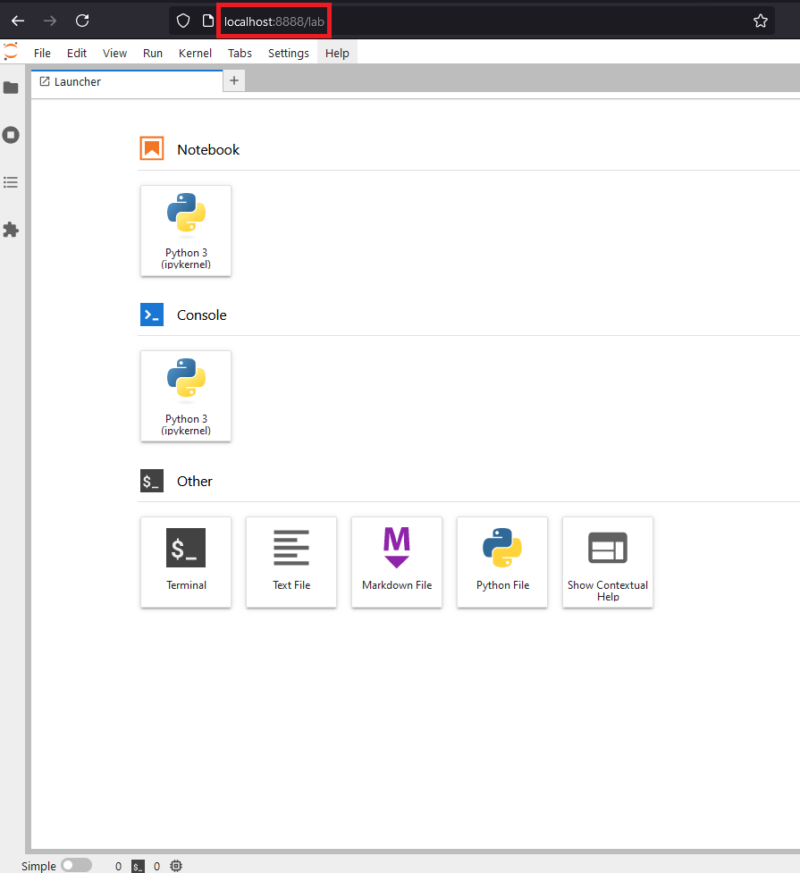

# PySpark Dev environment

## Español

Entorno para desarrollo con PySpark usando docker (imagen de [bitcami](https://github.com/bitnami/containers?tab=License-1-ov-file)).

### Requisitos
- Docker
- Docker compose

### Uso

Para poner a funcionar el entorno simplemente es necesario iniciarlo con:
```bash
docker-compose up -d
```

Una vez hemos iniciado los contenedores es necesario esperar unos segundos ya que tarda unos instantes en instalar e iniciar el servidor de jupyter.

Por defecto el servidor estará funcionando en el `localhost` pero en caso de querer usar la ip podemos obtenerla con el siguiente comando:
```bash
docker inspect  -f '{{range.NetworkSettings.Networks}}{{.IPAddress}}{{end}}' docker-spark-master-1
```
- Web



- VSCode   


Para apagarlo:
```bash
docker-compose down
```

### Explicación

El entorno por defecto consta de 2 `workers` y 1 `master`.

Desde el archivo [docker-compose](./docker/docker-compose.yml) el `master` ejecuta el script [docker-start](./docker/docker-start.sh), este lo que hace es:
1. Inicia spark
2. Instala las bibliotecas de `pyspark` y `notebook`.
3. Inicia el servidor de Jupyter.

**Importante**   
El servidor de Jupyter se inicia de manera que no requiere de contraseña y admite conexiones desde cualquier lado, no es recomendable mantener esta configuración en la mayoría de los casos.

```bash
jupyter-lab --ip=0.0.0.0 --port 8888 --no-browser --notebook-dir=/proyecto --NotebookApp.allow_origin="*" --allow-root --ServerApp.password='' --ServerApp.token='' --ServerApp.password_required=False
```

### Errores

En caso de usar linux es posible que el contenedor `master` devuelva un error, en ese caso es posible que sea necesario hacer lo siguiente antes de iniciar el entorno:
```shell
chmod +x docker-start.sh
```


## English

Environment for PySpark development using docker ([bitcami](https://github.com/bitnami/containers?tab=License-1-ov-file) image).

### Requisites
- Docker
- Docker compose

### Use

To get the environment working, you just need to start it with:
```bash
docker-compose up -d
```

Once we have started the containers, we need to wait a few seconds for the jupyter server to install and start.

By default the server will run on `localhost` but if you want to use the ip it's possible to get it with:
```bash
docker inspect  -f '{{range.NetworkSettings.Networks}}{{.IPAddress}}{{end}}' docker-spark-master-1
```
- Web


- VSCode   


To shutdown:
```bash
docker-compose down
```

### Explanation

By default, the environment has 2 `workers' and 1 `master'.

From the [docker-compose](./docker/docker-compose.yml) file the `master` runs the [docker-start](./docker/docker-start.sh) script, which that script does the following:

1. Start Spark
2. Install the `pyspark` and `notebook` libraries.
3. Start the Jupyter server.

**Important**   
The Jupyter server is started in a way that doesn't require a password and allows connections from anywhere, which is not recommended for most uses.

```bash
jupyter-lab --ip=0.0.0.0 --port 8888 --no-browser --notebook-dir=/proyecto --NotebookApp.allow_origin="*" --allow-root --ServerApp.password='' --ServerApp.token='' --ServerApp.password_required=False
```

### Errors

In case of using linux it is possible that the `master` container returns an error, in that case it may be necessary to do the following before starting the environment:
```shell
chmod +x docker-start.sh
```